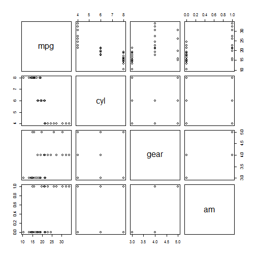

Coursera Data Products Week 4 Project
========================================================
author: Toby Jones
date: September 4, 2016
autosize: true

Overview
========================================================

This was built as part of a deliverable for the course Developing Data Products as part of the Coursera Data Science Specialization.

The app developed for the first part of the assignment demo is avalilable at: <https://tobiasint.shinyapps.io/Data_Products_Week_4/>

Source code for ui.R and server.R files are available on the GitHub repo: <https://github.com/tobiasjones/Data_Products_Week_4/>


Web Application Functionality
========================================================
This application provides the user with a box plot of MPG against three different variables (Cylinders, Transmission, and Gears)

Dataset
========================================================
The data used in the app comes from the Motor Trend Car Road Tests (mtcars) dataset. Let has a look on the mtcars's summary of the columns used in the application.

```r
summary(mtcars[,c('mpg','cyl','gear','am')])
```

```
      mpg             cyl             gear             am        
 Min.   :10.40   Min.   :4.000   Min.   :3.000   Min.   :0.0000  
 1st Qu.:15.43   1st Qu.:4.000   1st Qu.:3.000   1st Qu.:0.0000  
 Median :19.20   Median :6.000   Median :4.000   Median :0.0000  
 Mean   :20.09   Mean   :6.188   Mean   :3.688   Mean   :0.4062  
 3rd Qu.:22.80   3rd Qu.:8.000   3rd Qu.:4.000   3rd Qu.:1.0000  
 Max.   :33.90   Max.   :8.000   Max.   :5.000   Max.   :1.0000  
```

Plot the Relationship between the Columns
========================================================


